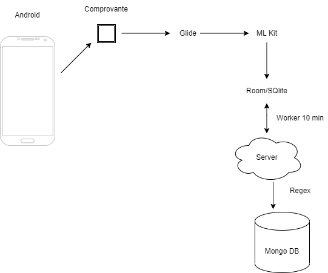
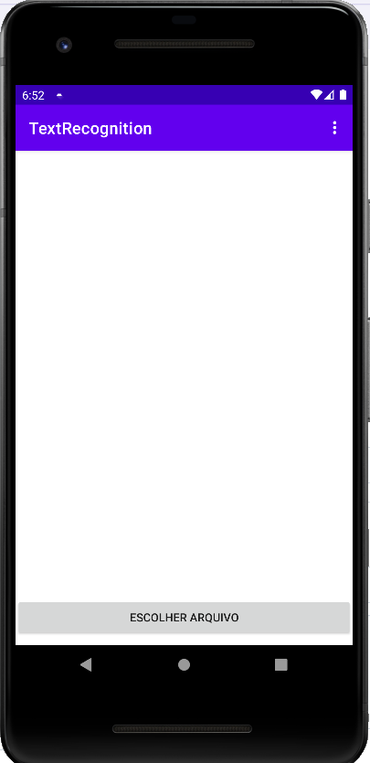
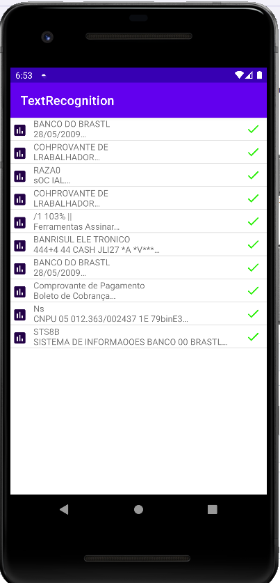
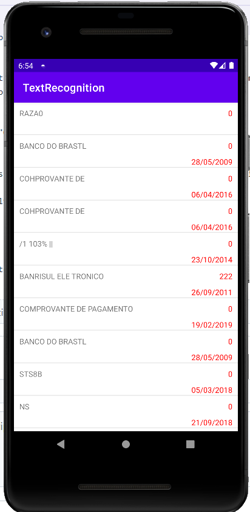
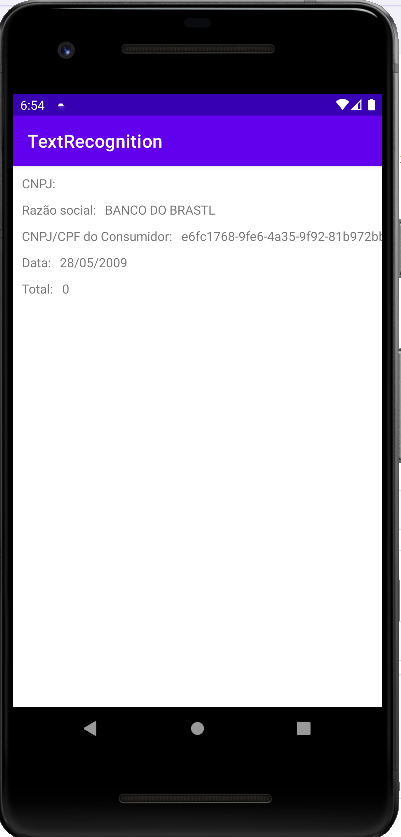

# ML-kit-Text-Recognition

## Projeto para Solution Sprint 3 do MBA de Engenharia de Software na Fiap ON

Foram utilizadas as seguintes tecnologias: 
### Parte Mobile
> Kotlin (Linguagem de programação);
> Room (Framework de persistência de dados);
> Glide (Para deixar a escala em cinza);
> ML Kit (biblioteca de machine learning);
> SQLite (banco interno);
> Retrofit (REST);

### Parte Back-End
> .Net 6.0;
> Atlas Mongo Db;
> Azure;

## Desenho da Arquitetura do Projeto
O aplicativo funciona da seguinte maneira: 
1 - Você escolhe o arquivo a ser lido 
2 - A imagem é convertida pra escala cinza
3 - A imagem é processada usando o Glide
4 - Os metadados são armazenados em um banco interno (SQlite) 
5 - Os metadados são sincronizados para o servidor (caso tenha internet).
Obs: Caso tente realizar o processamento de uma imagem que foi enviada anteriormente, o aplicativo mostra uma mensagem ao usuário dizendo que não é possível, evitando duplicidade dos dados.

  

## Funcionalidades e Prints de telas
Tela inicial do app:

  

Listagem de Comprovantes (Essa tela mostra todos os comprovantes processados que estão armazenados no banco de dados, caso esteja com o símbolo de "x" os metadados ainda não foram sincronizados com o servidor, caso esteja com o símbolo de "v" eles já foram.

  

Tela de Comprovantes processados (São os metadados processados e sincronizados com o servidor, caso clique em um item é possível ver os detalhes em outra tela)

Tela de detalhes do comprovante

  

## Execução do projeto
Para executar o projeto basta baixar o app no link: https://drive.google.com/file/d/1RXubZ4tyE6V8BoTEbjOecMzHdLz68PAw/view?usp=sharing e executar no seu smartphone android.
E para executar o projeto, baixe esse repo e no seu android studio, execute. Talvez seja necessário atualizar algumas coisas no android studio. A Versão q eu estava utilizando era a Canary (Artic Fox)

## Link do projeto back-end
https://github.com/pablopupulin/CorporateRefund
